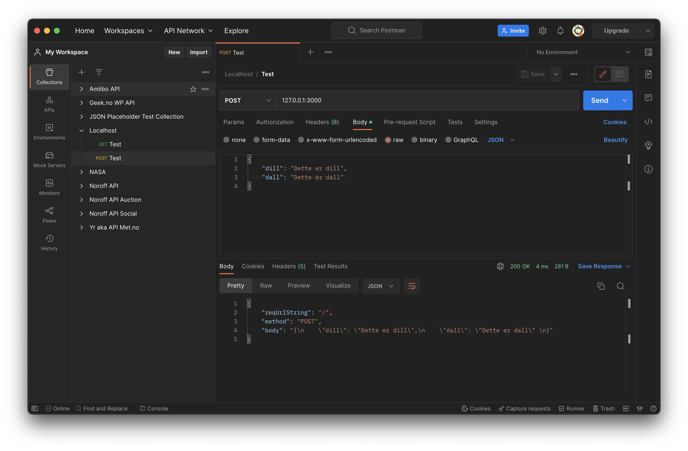

# Movies NodeJS + MongoDB

Example-project for making a very basic NodeJS + MongoDB app.

1. Initialize Node: `npm init -y`
    * Or re-initialize (if cloned/forked) with `npm i`, and skip 2 and 3.
1. Install mongodb: `npm i mongodb --save-dev`
1. Add start-script to package.json: `"start": "node app.js"` (for later use)
1. Sign up for [MongoDB Atlas](https://www.mongodb.com/atlas) with GitHub (or your preferred method), and make a cluster and (at least one DB user)
1. Add starter code to a test file `listMovies.js`:
    * Replace `<username>`, `<password>`, and `<cluster.hash>` with your own, you'll find the `uri` (sans Password) on Atlas under `Database Deployments` > `<Your Cluster>` > `Connect` > `Connect your application`:
    ```js
    const { MongoClient, ServerApiVersion } = require('mongodb');

    const uri = "mongodb+srv://<username>:<password>@<cluster.hash>.mongodb.net/?retryWrites=true&w=majority";
    const client = new MongoClient(uri, { useNewUrlParser: true, useUnifiedTopology: true, serverApi: ServerApiVersion.v1 });

    async function run() {
        try {
            await client.connect();
            console.log("Connected correctly to server");
            // Do stuff here

        } catch (err) {
            console.log(err.stack);
        }
        finally {
            await client.close();
        }
    }

    run().catch(console.dir);
    ```
1. Run the code, using `node listMovies.js`
    * Make sure you get `Connected correctly to server` on the console
1. Add database details: 
    ```js
            // Do stuff here
            // Connect to this database, make it if it doesn't exist
            const db = client.db("node_testing");
            // Use this collection, make it if it doesn't exist
            const col = db.collection("movies");
    ```
1. Add a test movie: 
    ```js
        // Add a test-movie, if it doesn't exist using updateOne
        const filter = { title: "True Romance" };
        const movie = {
            $set: {
                title: "True Romance", 
                year: 1993, 
                imdb_url: "https://www.imdb.com/title/tt0108399/",
                rt_url: "https://www.rottentomatoes.com/m/true_romance",
                rating: 6    
            }
        };
        const options = { upsert: true };
        const result = await col.updateOne(filter, movie, options);
        console.log(`${result.matchedCount} document(s) matched the filter`);
    ```
1. Re-run, and check Atlas to see the new (?) Database `node_testing` with a new (?) collection `movies` that contains (at least) one movie.
1. Now, we'll make a new file `app.js` some JSON output.
1. Add requirements, and local variables: 
    ```js
    const http = require('http');
    let url = require('url');

    const hostname = '127.0.0.1';
    const port = 3000;
    ```
1. Add a function for returning JSON:
    ```js
    let sendData = (res, body) => {
        res.statusCode = 200;
        res.setHeader('Content-Type', 'application/json');
        res.write(JSON.stringify(body));
        res.end();
    }
    ```
1. Create a server and add a couple of endpoints: 
    ```js
    const server = http.createServer((req, res) => {
        let reqUrlString = req.url;

        if (reqUrlString === "/") {
            sendData (res, "Use endpoints GET /list or POST /add");
        } else if (reqUrlString === "/list") {
            sendData (res, "Will list all movies");
        } else if (reqUrlString === "/add") {
            let method = req.method;
            if (method === "POST" || method === "PUT") {
                sendData (res, "Will add movie, if data object is posted correctly");
            } else {
                sendData (res, "You need to use POST (or PUT) here..."); 
            }
        } else {
            sendData (res, { 404: "Not found"});
        }
    });
    ```

---

Tip: You can use [Postman](https://www.postman.com/product/what-is-postman/) to send post requests to localhost: 
