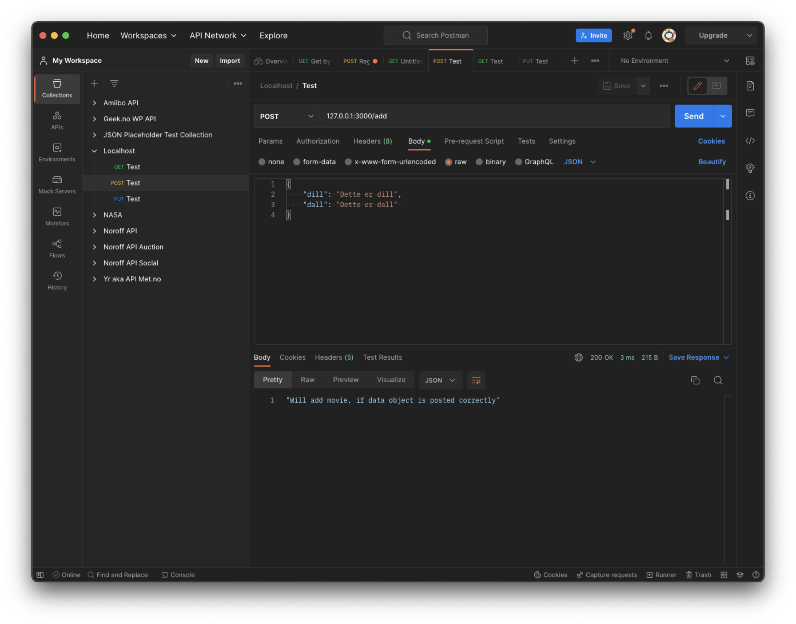
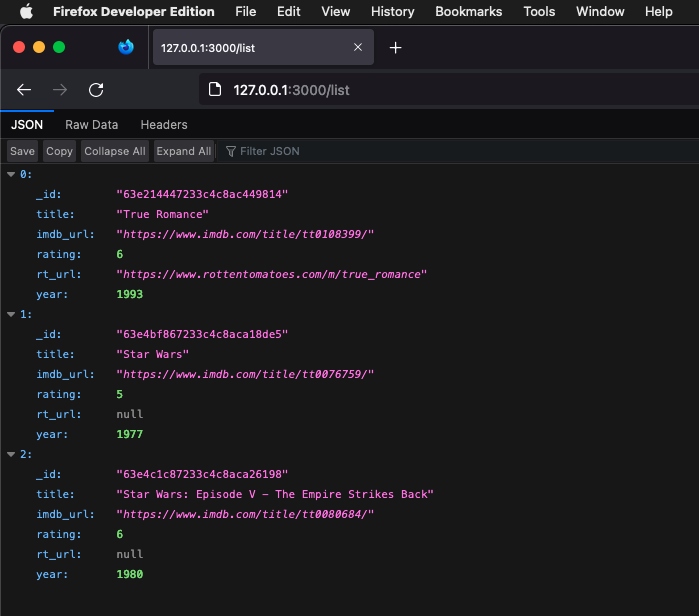

# Movies API using NodeJS + MongoDB + Vercel

Example-project for making a very basic NodeJS + MongoDB app providing an API to a movie database, and publish the API on Vercel.

## Rigging

1. Make a new GitHub repo and clone it to your local machine
1. In the repo/projects folder, initialize Node: `npm init -y`
    * Or re-initialize (if alreadycloned or forked) with `npm i`, and skip 3 and 4.
1. Install mongodb: `npm i mongodb --save-dev`
1. Add start-script to package.json: `"start": "node app.js"` (for later use)
1. Sign up for [MongoDB Atlas](https://www.mongodb.com/atlas) with GitHub (or your preferred method), and make a cluster and (at least one DB user)

## Testing db

1. Before we get started, let's try out the database-connection. Add this starter code to a test file `listMovies.js`:
    ```js
    const { MongoClient, ServerApiVersion } = require('mongodb');

    const uri = "mongodb+srv://<username>:<password>@<cluster.hash>.mongodb.net/?retryWrites=true&w=majority";
    const client = new MongoClient(uri, { useNewUrlParser: true, useUnifiedTopology: true, serverApi: ServerApiVersion.v1 });

    async function run() {
        try {
            await client.connect();
            console.log("Connected correctly to server");
            // Do stuff here

        } catch (err) {
            console.log(err.stack);
        }
        finally {
            await client.close();
        }
    }

    run().catch(console.dir);
    ```
    > Replace `<username>`, `<password>`, and `<cluster.hash>` with your own, you'll find the `uri` (sans Password) on Atlas under `Database Deployments` > `<Your Cluster>` > `Connect` > `Connect your application`
    >
    > **NOTE**: Make a non-admin database user (that can be discarded), for this project, or protect your login-URI.
1. Run the code, using `node listMovies.js`
    * Make sure you get `Connected correctly to server` on the console
1. Add database details: 
    ```js
            // Do stuff here
            // Connect to this database, make it if it doesn't exist
            const db = client.db("node_testing");
            // Use this collection, make it if it doesn't exist
            const col = db.collection("movies");
    ```
1. Add a test movie: 
    ```js
            // Add a test-movie, if it doesn't exist using updateOne
            const filter = { title: "True Romance" };
            const movie = {
                $set: {
                    title: "True Romance", 
                    year: 1993, 
                    imdb_url: "https://www.imdb.com/title/tt0108399/",
                    rt_url: "https://www.rottentomatoes.com/m/true_romance",
                    rating: 6    
                }
            };
            const options = { upsert: true };
            const result = await col.updateOne(filter, movie, options);
            console.log(`${result.matchedCount} document(s) matched the filter`);
    ```
1. Re-run, and check Atlas to see the new (?) Database `node_testing` with a new (?) collection `movies` that contains (at least) one movie: "True Romance"

## Making API

1. Now, we'll make a new file `app.js` some JSON output.
1. Add requirements, and local variables: 
    ```js
    const http = require('http');
    let url = require('url');

    const hostname = '127.0.0.1';
    const port = 3000;
    ```
1. Add a function for returning JSON from the `body` parameter:
    ```js
    let sendData = (res, body) => {
        res.statusCode = 200;
        res.setHeader('Content-Type', 'application/json');
        res.write(JSON.stringify(body));
        res.end();
    }
    ```
1. Create a server and add a couple of endpoints: 
    ```js
    const server = http.createServer((req, res) => {
        let reqUrlString = req.url;
        let path = url.parse(reqUrlString, true).pathname;
        //console.log({reqUrlString, path});

        if (path === "/") {
            sendData (res, "Use endpoints GET /list or POST /add");
        } else if (path === "/list") {
            // Find and list all movies
            sendData (res, "Will list all movies");
        } else if (path === "/add") {
            // Check POST data and use update one 
            // with upstream set to true 
            // to insert (or update) movie
            let method = req.method;
            if (method === "POST" || method === "PUT") {
                sendData (res, "Will add movie, if data object is posted correctly");
            } else {
                sendData (res, "You need to use POST (or PUT) here..."); 
            }
        } else {
            // Catch all for un-recognized paths
            sendData (res, { 404: path});
        }
    ```
1. And code for starting the server: 
    ```js
    server.listen(port, hostname, () => {
        console.log(`Server running at http://${hostname}:${port}/`);
    });
    ```
1. Now run the app with `npm start`, and test with a few GET and POST requests.
    > Tip: You can use [Postman](https://www.postman.com/product/what-is-postman/) to send post requests to localhost: 
    
1. Add DB-connection to app.js: 
    ```js
    const http = require('http');
    let url = require('url');
    const { MongoClient, ServerApiVersion } = require('mongodb');
    const uri = "mongodb+srv://<username>:<password>@<cluster.hash>.mongodb.net/?retryWrites=true&w=majority";
    const client = new MongoClient(uri, { useNewUrlParser: true, useUnifiedTopology: true, serverApi: ServerApiVersion.v1 });
    ```
    > **Again**: Replace `<username>`, `<password>`, and `<cluster.hash>` with your own non-admin database user (that can be discarded), for this project, or protect your login-URI.
1. In the server function, change the list:
    ```js
        } else if (path === "/list") {
            // Find and list all movies
            console.log ("Will list all movies");
            connectToDB(res, "list", {});
        } //...
    ```
1. Make the `connectToDB` function:
    ```js
    async function connectToDB (res, method, body) {
        console.log ({method, body});
        try {
            await client.connect();
            // console.log("Connected correctly to server");
            // Connect to this database
            const db = client.db("node_testing");
            // Use this collection
            const col = db.collection("movies");
            
            // Do stuff here
            if (method === "list") {
                const query = {};
                const opt = {};
                const cursor = col.find(query, opt);
                
                let results = await cursor.toArray();
                //console.log(results);
                if (results.length > 0) {
                    sendData(res, results);    
                } else {
                    sendData(res, {});  
                }    
            } else if (method === "add") {
                //...
            }
        } catch (err) {
            console.log(err.stack);
        }
        finally {
            await client.close();
        }
    }
    ```
1. Now re-run app and go to the listing: http://127.0.0.1:3000/list
    
1. In the server function, change the code for "add", to het posted data: 
    ```js
        } else if (path === "/add") {
            // Check POST data and use update one 
            // with upstream set to true 
            // to insert (or update) movie
            let method = req.method;
            if (method === "POST" || method === "PUT") {
                console.log ("Will add movie, if data object is posted correctly");
                let body = [];
                req .on('error', (err) => { console.error(err); })
                    .on('data', (chunk) => { body.push(chunk); })
                    .on('end', () => { 
                        body = JSON.parse(Buffer.concat(body).toString()); 
                        connectToDB(res, "add", body);
                    });
            } else {
                sendData (res, "You need to use POST (or PUT) here..."); 
            }
        }
    ```
    > Note you should handle the error and also check to see if the posted data (body) conforms to your database scheme
1. Now add code to the "add" part of the `connectToDB` function:
    ```js
            } else if (method === "add") {
                const filter = { title: body.title };
                const movie = {
                    $set: {
                        title: body.title, 
                        year: body.year, 
                        imdb_url: body.imdb_url,
                        rt_url: body.rt_url,
                        rating: body.rating
                    }
                };
                const options = { upsert: true };
                const result = await col.updateOne(filter, movie, options);
                //console.log(`${result.matchedCount} document(s) matched the filter`);
                sendData(res, `${result.matchedCount} document(s) matched the filter`);
            }
    ```
1. Now you can POST (via Postman or your own app) to the /add endpoint: 
    
    > Note, if it replies with "0 document(s) matched the filter" then a document has been created; if it replies with "1 document(s) matched the filter" then a document has been updated 
1. Or use PUT to the /add endpoint: 
    
    > Note, you could make a distinction between POST and PUT, where - for put - you use the `_id` object for filtering to allow "duplicate titles", and - for post - just use `insertOne()` and not `updateOne()`.
1. Now you can list (at least) 3 documents, via Atlas:
    
    ...or your listing endpoint: 
    


## Publishing [^DeplyNodeToVercel]

[^DeplyNodeToVercel]: [Deploy a Serverless Node.js application to Vercel in 5 minutes](https://dev.to/adafycheng/deploy-nodejs-application-to-vercel-in-5-minutes-171m)

[Vercel](https://vercel.com/home) is the platform for frontend developers, providing the speed and reliability innovators need to create at the moment of inspiration.

1. [Sign up on Vercel](https://vercel.com/signup) using GitHub (or your preferred method)
    > Note, on the first try Vercel just added one of my teams_, and I had to choose "+ Add GitHub account" to add my personal reops and not just those from that team.
1. Add a `vercel.json` file to your project: 
    ```json
    {
        "version": 2,
        "name": "movies",
        "builds": [
            { "src": "app.js", "use": "@vercel/node" }
        ],
        "routes": [
            { "src": "/(.*)", "dest": "/app.js" }
        ]
    }
    ```
1. In Vercel, choose "Create New Project"
1. Import the correct Git Repository
1. On Atlas, add the IP 0.0.0.0/0 to the Network Access IP Address List, to allow Vercel to connect [^AtlasVercel]
1. Now try the listing: https://movies-node.vercel.app/list

[^AtlasVercel]: [MongoDB Atlas > Integrate with Vercel](https://www.mongodb.com/docs/atlas/reference/partner-integrations/vercel/)
